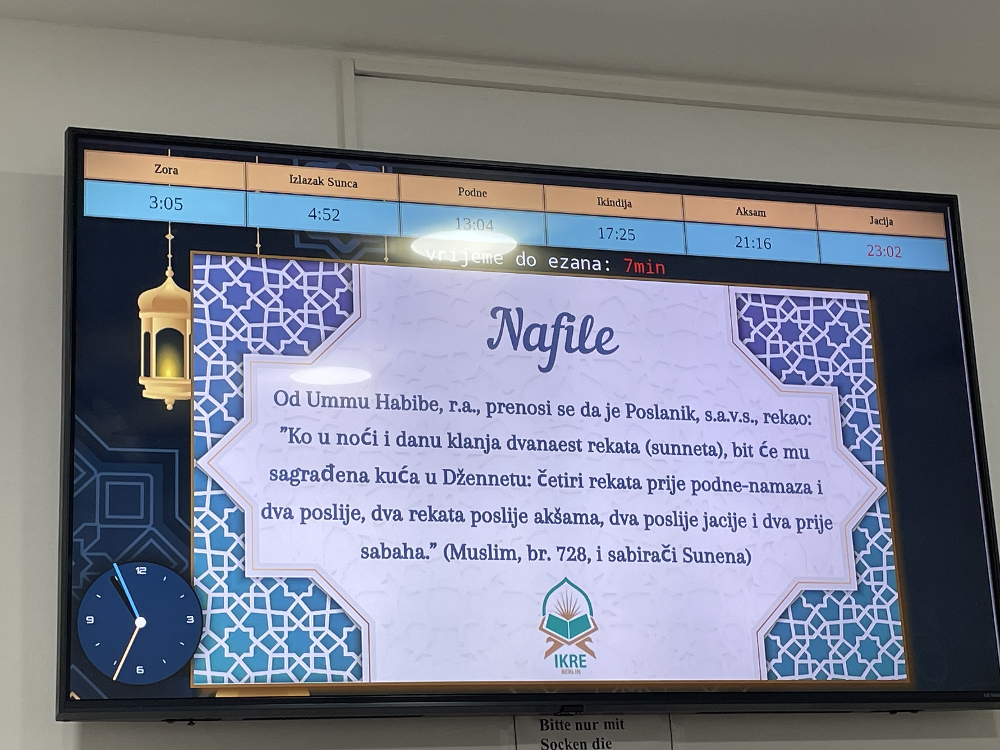

Dieses Projekt wird benutzt, um in einer lokalen, bosnischen Moschee die aktuellen
Gebetszeiten anzuzeigen, sowie die verbleibende Zeit bis zum nächsten Gebet. Außerdem werden Infos über Bilder angezeigt, die sich alle 60 Sekunden ändern. Alternativ kann man auf die Bildfläche klicken um ein neues, zufällig ausgewähltes Bild anzuzeigen.

Website unter: https://hamzaprivate.github.io/moschee_display/demo.html
(nicht für mobile konzipiert)
